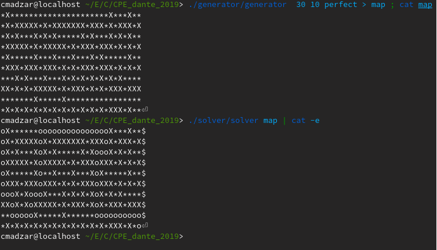

# CPE_dante_2019

Open dante_project.pdf to see the project's instructions

In this project, you have to program an algoritm to generate mazes, solve them and print the solution.

USAGE: 
  -make 
  -./generator/generator width height (perfect) > map.txt 
  -./solver/solver map.txt ; cat map 
  

